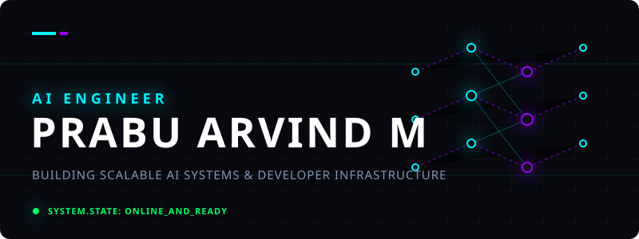
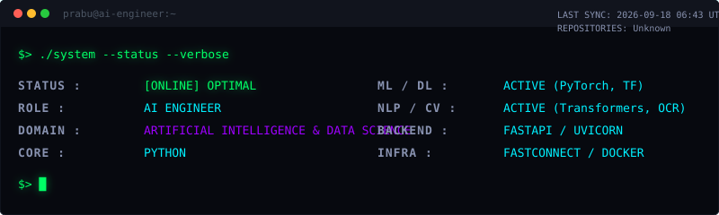
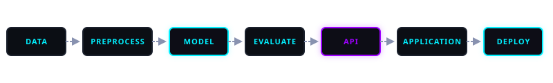
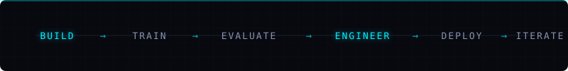

<div align="center">
  
</div>

<br>

<div align="center">
  
</div>

---

## ⚡ ABOUT ME

I am an **AI Engineer** focused on architecting and deploying end-to-end artificial intelligence systems. My expertise bridges the gap between machine learning models and production-ready applications. I specialize in **Document Intelligence (OCR), Natural Language Processing, Computer Vision**, and building the robust **Backend APIs** (FastAPI) and **Developer Infrastructure** required to deploy them. 

My engineering philosophy is simple: **A model is not a product until it's deployed and usable.**

---

<div align="center">
  <h3>AI ENGINEERING PIPELINE</h3>
  
</div>

---

## 🛠️ ENGINEERING STACK

<table>
  <tr>
    <td width="50%">
      <h3>🧠 AI / MACHINE LEARNING</h3>
      <code>Python</code> <code>PyTorch</code> <code>TensorFlow</code> <code>Keras</code> <code>Scikit-learn</code>
    </td>
    <td width="50%">
      <h3>🗣️ NLP / GENERATIVE AI</h3>
      <code>Transformers</code> <code>BERT</code> <code>GPT</code> <code>Pegasus</code> <code>RoBERTa</code>
    </td>
  </tr>
  <tr>
    <td width="50%">
      <h3>👁️ COMPUTER VISION / OCR</h3>
      <code>PaddleOCR</code> <code>Tesseract</code> <code>docTR</code> <code>YOLO</code> <code>DotsOCR</code>
    </td>
    <td width="50%">
      <h3>⚙️ BACKEND & INFRASTRUCTURE</h3>
      <code>FastAPI</code> <code>Flask</code> <code>Uvicorn</code> <code>REST APIs</code> <code>FastConnect</code>
    </td>
  </tr>
  <tr>
    <td width="50%">
      <h3>📊 DATA</h3>
      <code>NumPy</code> <code>Pandas</code> <code>SQL</code> <code>Matplotlib</code>
    </td>
    <td width="50%">
      <h3>🚀 ENGINEERING / DEVOPS</h3>
      <code>Git</code> <code>GitHub Actions</code> <code>Docker</code> <code>Linux</code>
    </td>
  </tr>
</table>

---

## 🔬 AI LAB // SELECTED SYSTEMS

> **Note:** The following repositories demonstrate my ability to build across the entire AI engineering stack, from raw model training to developer infrastructure.

### 01 // FASTConnect 
**BACKEND ENGINEERING / DEVELOPER TOOLING**
> A developer-friendly abstraction layer built on top of FastAPI. It drastically removes repetitive boilerplate for database setup and API configurations, transforming FastAPI development into a rapid, streamlined process.

* **Tech Stack:** `Python` • `FastAPI` • `Pydantic` • `Uvicorn` • `API`
* **Architecture:** `Developer` → `FastConnect` → `Application Setup` → `FastAPI` → `API` → `Deployment`
* 🔗 [View System: FASTConnect](https://github.com/PrabuArvindM/FASTConnect)

<br>

### 02 // DotsOCR Pipeline
**DOCUMENT INTELLIGENCE / OCR ENGINEERING**
> A production-ready OCR API developed during my L&T Construction internship. It uses the 1.7B-parameter DotsOCR multimodal model combined with a FastAPI backend to process complex document layouts, supporting multi-page PDF conversion and text extraction with CPU-fallback robust inference.

* **Tech Stack:** `Python` • `PyTorch` • `FastAPI` • `OCR` • `Vision-Language Models`
* **Architecture:** `Document` → `PDF-to-Image Preprocessing` → `Multimodal OCR Inference` → `Text Normalization` → `Structured Output`
* 🔗 [View System: DotsOCR-Pipeline](https://github.com/PrabuArvindM/DotsOCR-Pipeline)

<br>

### 03 // MY Website
**AI ENGINEER PORTFOLIO / DIGITAL PRESENCE**
> My personal digital footprint showcasing projects, research, and engineering capabilities, built as a modern web application.

* **Tech Stack:** `JavaScript` • `HTML/CSS` • `Web Application`
* **Architecture:** `Code` → `Web Application` → `Deployment` → `Portfolio`
* 🔗 [View System: MY_Website](https://github.com/PrabuArvindM/MY_Website)

<br>

### 04 // PyMorph AI (AI Code Converter)
**AI DEVELOPER TOOL / CODE TRANSFORMATION SYSTEM**
> A full-stack AI application using Google's Gemini API to translate Python source code into Java, C, C++, Embedded C, and Swift. Includes a VS Code-inspired online Monaco Editor and a secure sandbox for live Python execution.

* **Tech Stack:** `Python` • `FastAPI` • `Google Gemini API` • `Monaco Editor`
* **Architecture:** `Source Code` → `Monaco Editor` → `Gemini Translation Engine` → `Target Language` → `Generated Code`
* 🔗 [View System: AI-Code-Converter](https://github.com/PrabuArvindM/AI-Code-Converter)

<br>

### 05 // News Article Summarizer
**NLP / AI SUMMARIZATION**
> An AI-based natural language processing system that digests news articles and produces concise, accurate summaries utilizing state-of-the-art NLP techniques.

* **Tech Stack:** `Python` • `NLP` • `Transformers` • `Summarization`
* **Architecture:** `Article/Document` → `Text Extraction` → `NLP Processing` → `Summarization Engine` → `Result`
* 🔗 [View System: news-article-summarizer](https://github.com/PrabuArvindM/news-article-summarizer)

<br>

### 06 // Cancer Prediction
**COMPUTER VISION / DEEP LEARNING**
> A deep learning system trained on a Kaggle histopathology dataset to detect cancerous vs. non-cancerous cells from microscopy pathology images, equipped with an upload feature for prediction.

* **Tech Stack:** `Python` • `Deep Learning` • `Computer Vision` • `Histopathology`
* **Architecture:** `Microscopy Image` → `Preprocessing` → `Deep Learning Model` → `Classification` → `Result`
* 🔗 [View System: CancerPrediction](https://github.com/PrabuArvindM/CancerPrediction)

---

## 🏗️ SYSTEM ARCHITECTURE

```text
                AI ENGINEER
                     │
    ┌────────────────┼────────────────┐
    ↓                ↓                ↓
   AI/ML            NLP              CV
    │                │                │
 Models          Transformers        OCR
    │                │                │
    └────────────────┼────────────────┘
                     ↓
                APPLICATIONS
                     ↓
                   APIs
                     ↓
              FASTCONNECT
                     ↓
                DEPLOYMENT
```

---

## 💡 ENGINEERING PHILOSOPHY

<div align="center">
  <h3>MODEL ≠ PRODUCT</h3>
  <br>
  <code>MODEL</code> ➔ <code>API</code> ➔ <code>APPLICATION</code> ➔ <code>DEPLOYMENT</code>
</div>
<br>

My engineering philosophy prioritizes real-world usability. A highly accurate model sitting in a Jupyter Notebook is an experiment; that same model wrapped in a FastAPI endpoint, containerized via Docker, and deployed as a microservice is a **product**. I build the latter.

---

## 🏢 EXPERIENCE

* **AI Engineering Intern @ L&T Construction** 
  * Developed and implemented robust Document Intelligence and OCR systems (DotsOCR Pipeline).
  * Built production-ready APIs and backend abstractions for scalable AI application deployments.

---

## 🌐 CONNECT

* 🐙 **GitHub:** [@PrabuArvindM](https://github.com/PrabuArvindM)
* 💼 **LinkedIn:** [Prabu Arvind M](https://www.linkedin.com/in/prabuarvindm)

---

<div align="center">
  
</div>
